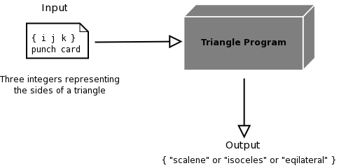

# Lab 1-1 Myers Challenge

## Recap

The statement of the problem from Myers
- A program reads three integer values from a card.  
- The three values are interpreted as representing the lengths of the sides of a triangle. 
- The program prints a message that states whether the triangle is scalene, isosceles, or equilateral. 
- On a sheet of paper, write test cases (i.e., specific sets of data) that you feel would adequately test this program. 

First though, regard the description in the image as a specification since it actually is.
- Push back on the specification and identify what onr item needs to be added to it in order that is usable
- Go through the IEEE properties list as a guide

The one thing that you should have spotted is that the spec does not describe what should happen if the input is invalid
- This is a common problem with specs, the people who write them tend to be focused on describing the valid cases and defer the invalid cases
- For now, we will assume the spec has been changed to state that an invalid input will generate an error messsage

## Solution

We can break the spec down into several criteria that have to be satisfied for the input to be valid
1. There have to be three inputs
2. They must be integers
3. They must represent the sides of a triangle

### Valid cases
We can use equivalence classing to come up with three cases

- V1: Equilateral (2, 2, 2) -> Equilateral
- V2: Isosceles  (2, 2, 3) -> Isosceles
- v3: Scalene  (2, 3, 4)  -> Scalete

But we might also consider that the programmer might have messed up the logic comparing one of the sides, like the first input.
- This is only going to affect how the sides of the isosceles are permuted, so we have two more cases

- V4: Isosceles  (2, 3, 2) -> Isosceles
- V5: Isosceles  (3, 2, 2) -> Isosceles

This exhausts all the valid classes

### Invalid cases 1

The first requirement that can be broken to produce invalid input is the number of inputs.
- We use boundary value analysis an just alter one of the valid cases test value to avoid introducing hidden errors

- IV1: No input (always test the null case) () -> Error
- IV2: Too few inputs (2, 2) -> Error
- IV3: Too many inputs (2, 3, 4, 5) -> Error

### Invalid cases 2

The next requirement that can be broken to produce invalid input is that we have a non integer input
- We will have to test for invalid input in each position
- How is something not an integer?
  - It is a real number
  - It is not numeric

- IV4: Non-numeric (2, 3, "4") -> Error
- IV5: Non-numeric (2, "3", 4) -> Error
- IV6: Non-numeric ("2", 3, ) -> Error
- IV7: Non-integral (2, 3, 4.1) -> Error
- IV8: Non-integral (2, 3.1, 4) -> Error
- IV9: Non-integral (2.1, 3, ) -> Error

### Invalid cases 3

The next requirement that can be broken to produce invalid input is that we the integer represent the side of a triangle. This means
- It is non negative
- It is not zero
- It satisfies the triangle inequality, the sum of any two sides must be greate than the third

- IV10: Negative (2, 3, -4) -> Error
- IV11: Negative (2, -3, 4) -> Error
- IV12: Negative (-2, 3, ) -> Error
- IV13: Zero (2, 3, 0) -> Error
- IV14: Zero (2, 0, 4) -> Error
- IV15: Zero (0, 3, ) -> Error
- IV15: Not a triangle  (1, 2, 3) -> Error

##e End