# Lab 4-1: Jenkins Basics

This lab walks you through the basics of setting up a Jenkins job

## Part 1: Start Jenkins

- Go the Jenkins directory and start the Jenkins installation as shown

```bash
protech@studentvm:$ cd 
protech@studentvm:~$ ls
branchlab  Documents  eclipse       go       lab1   Pictures  RocketDemo1  snap                   Templates  Videos
Desktop    Downloads  eclipse-test  Jenkins  Music  Public    sec          Springboot-Playground  test
protech@studentvm:~$ cd Jenkins

protech@studentvm:~/Jenkins$ ls
jenkins.war
protech@studentvm:~/Jenkins$ java -jar jenkins.war
Running from: /home/protech/Jenkins/jenkins.war
webroot: /home/protech/.jenkins/war
2025-10-18 18:58:04.893+0000 [id=1]	INFO	winstone.Logger#logInternal: Beginning extraction from war file
2025-10-18 18:58:05.016+0000 [id=1]	WARNING	o.e.j.ee9.nested.ContextHandler#setContextPath: Empty contextPath
2025-10-18 18:58:05.135+0000 [id=1]	INFO	org.eclipse.jetty.server.Server#doStart: jetty-12.0.22; built: 2025-06-02T15:25:31.946Z; git: 335c9ab44a5591f0ea941bf350e139b8c4f5537c; jvm 21.0.8+9-Ubuntu-0ubuntu122.04.1
2025-10-18 18:58:05.771+0000 [id=1]	INFO	o.e.j.e.w.StandardDescriptorProcessor#visitServlet: NO JSP Support for /, did not find org.eclipse.jetty.ee9.jsp.JettyJspServlet
....

2025-10-18 18:58:15.870+0000 [id=43]	INFO	jenkins.InitReactorRunner$1#onAttained: Loaded all jobs
2025-10-18 18:58:15.889+0000 [id=43]	INFO	jenkins.InitReactorRunner$1#onAttained: Configuration for all jobs updated
2025-10-18 18:58:15.933+0000 [id=61]	INFO	hudson.util.Retrier#start: Attempt #1 to do the action check updates server
2025-10-18 18:58:15.990+0000 [id=44]	INFO	jenkins.InitReactorRunner$1#onAttained: Completed initialization
2025-10-18 18:58:16.082+0000 [id=33]	INFO	hudson.lifecycle.Lifecycle#onReady: Jenkins is fully up and running

```

- Once you see Jenkins is up, open the Firefox browser in the VM and go to `http://localhost:8080`
- You should see this

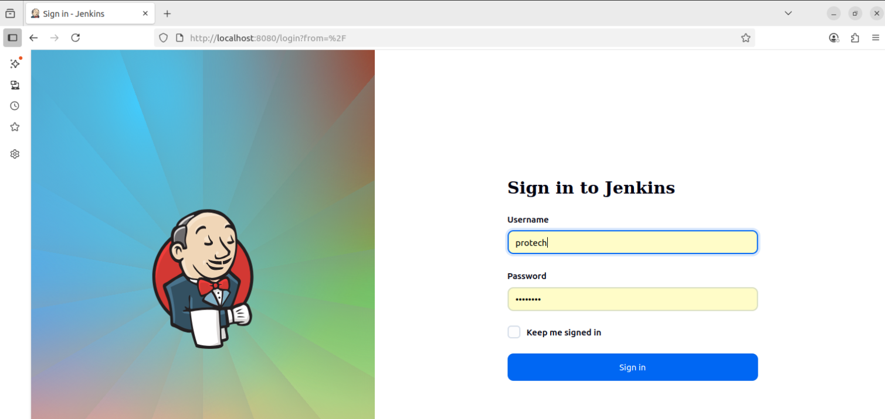

- The username and password should autofill
- If not, user
  - User: protech
  - Password: Pa$$w0rd

- Log in
- And you should see

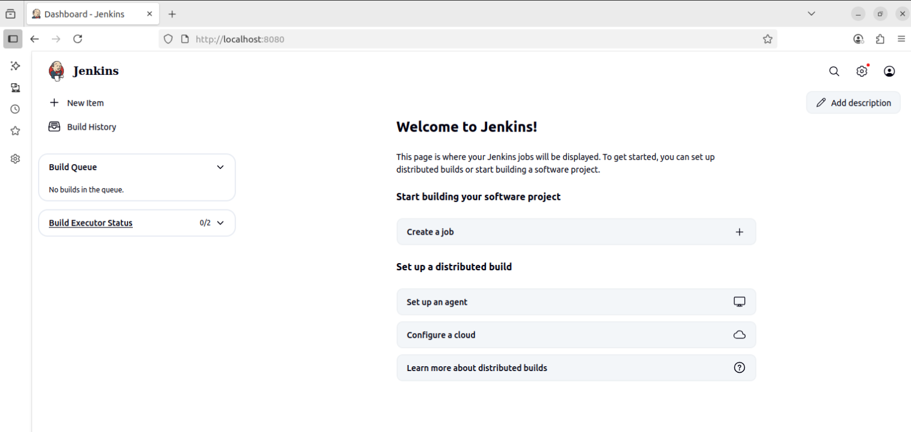

## Part 2: Create a Freestyle project

- One of the ways that Jenkins can be used is to call different tools like Github, Maven and other via plugins
- This is an older way of using Jenkins

- From the main panel, select the “Add Item” option and create a new Freestyle Project called “Hello World” by supplying the name, click on the FreeStyle project and selecting "ok"

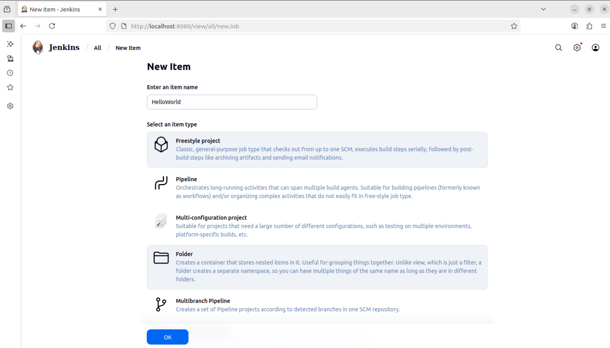

- This should open the configuration screen as show below

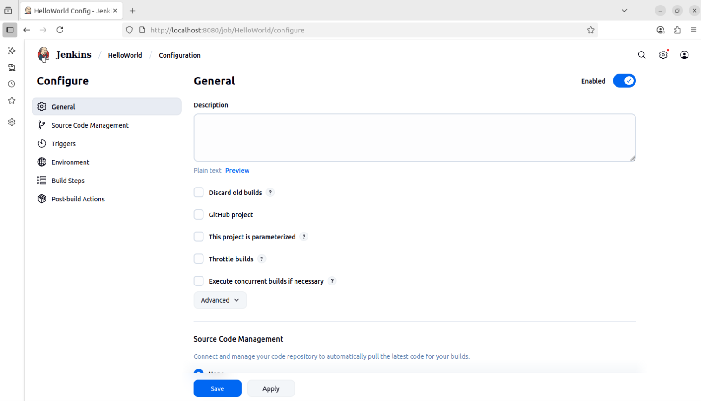

- We won't be using the Source Code management section
- Scroll down to the "Build Steps" section and select "Add build step"
- Select the "Execute shell" option


- Add the command to just print out "Hello World"

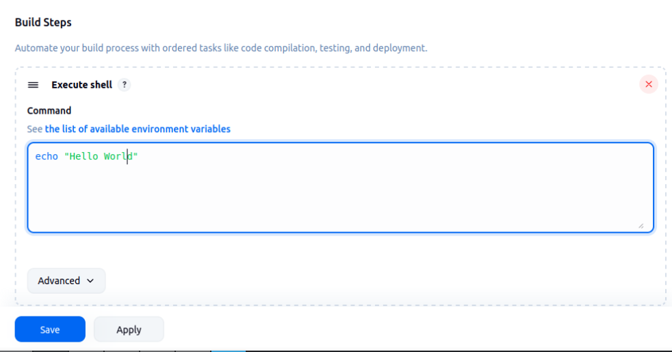

- Select "Save"
- Select the Jenkins Dashboard and you will see your project

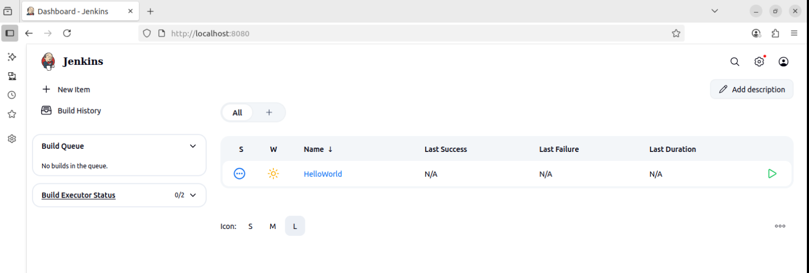

- The number of executors is the number of CPUs available to execute the job on this node
- Run the job by selecting the green arrow on the right of the project
- To see the builds, check use the "Build History"
- The screen shows that two builds were run successfully and an older build was deleted.

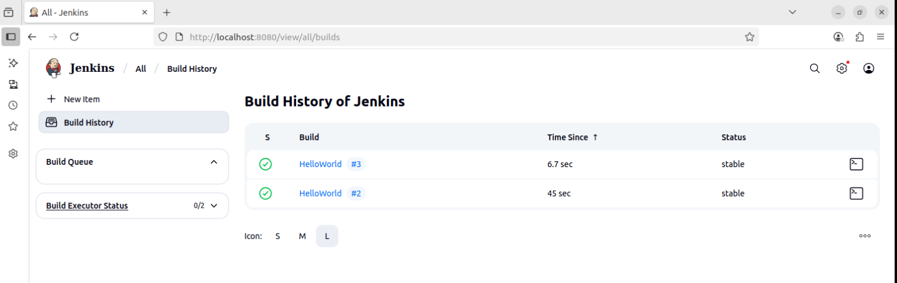

- Select your build and click on it
- You should see this

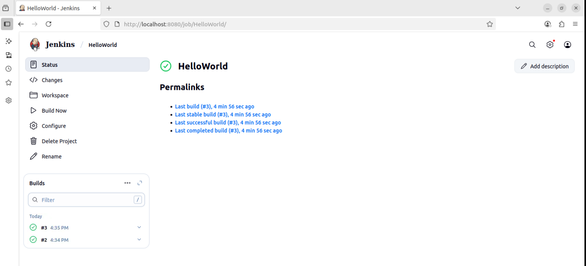

- Select the build number in the lower left and open it to see the results of the build

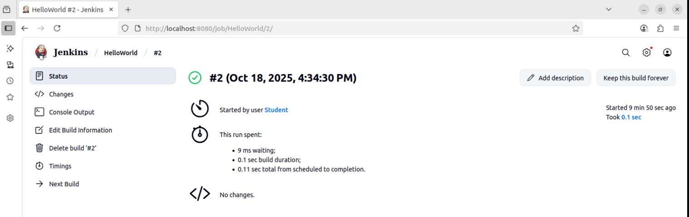

- Check the "Console output" tab to see the output of the command

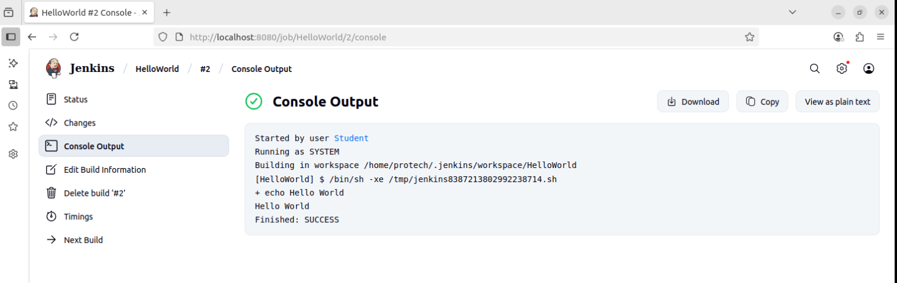


### Failed Builds

- Go back to the build step for the project and misspell "echo"
- You can get back to this step by selecting "Configure" in the project
- Save the project then run it
- You should see a failure like this

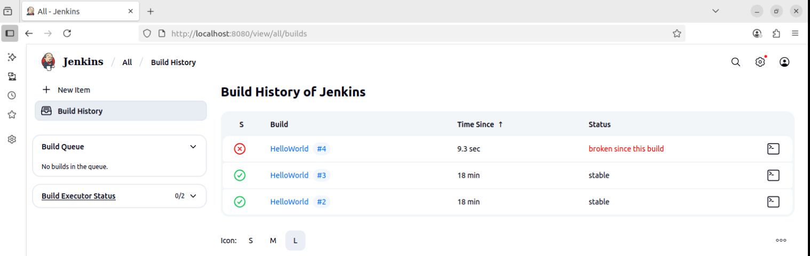

- Check out the build history and confirm the error output at the console

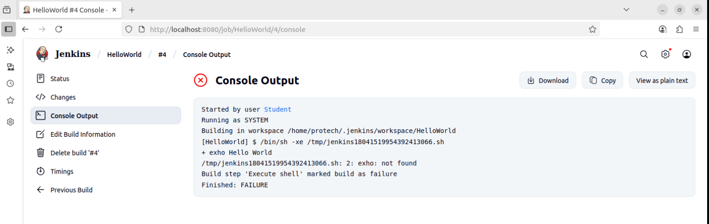

### Weather

- The weather icon shows the status of that last few builds from "stormy" (recent builds failed) to "sunny" (recent builds passed)
- Experiment with seeing how this changes by running a series of failed builds followed by a series of 

---

### End


