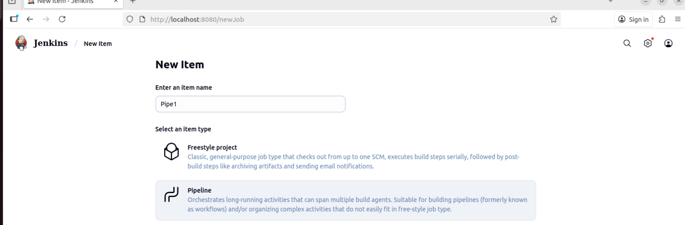
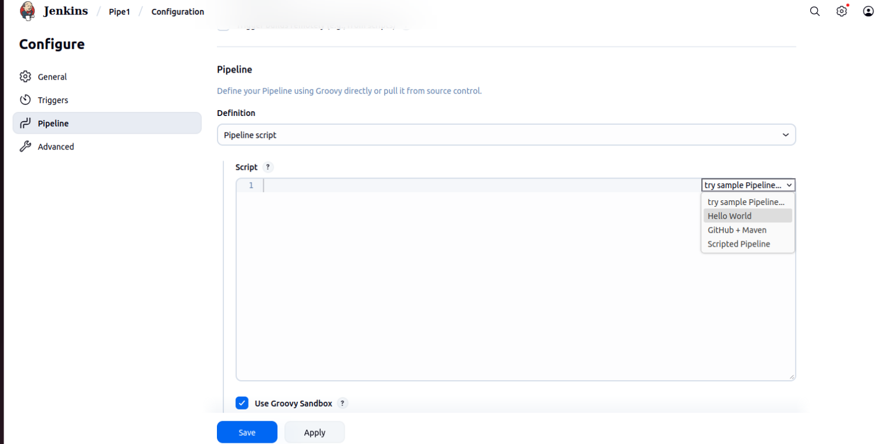
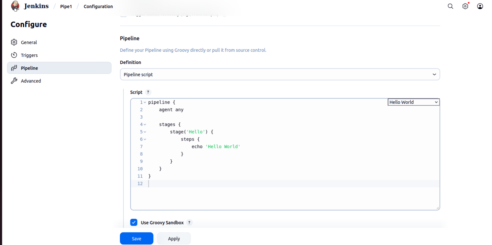
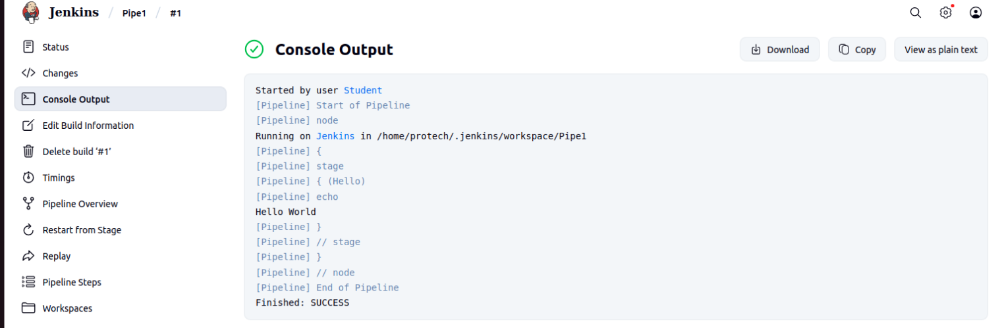
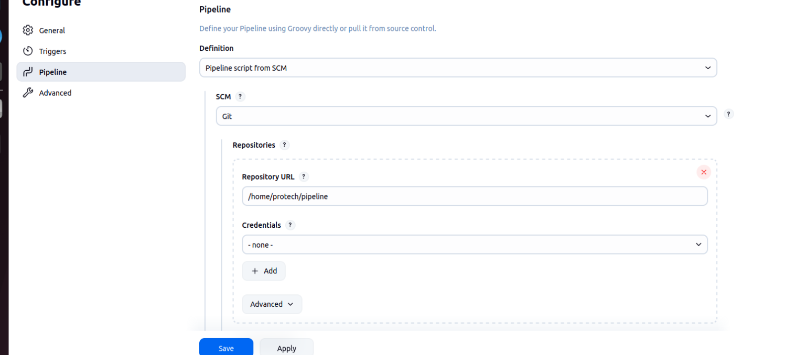
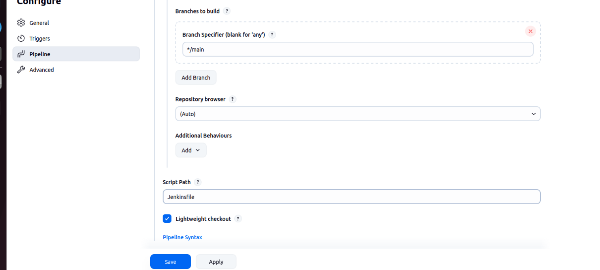
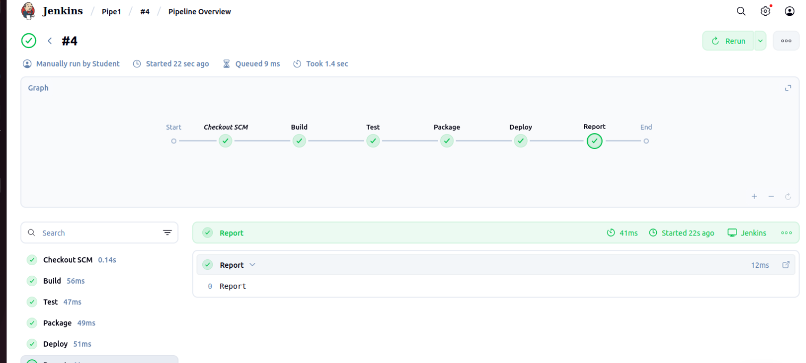
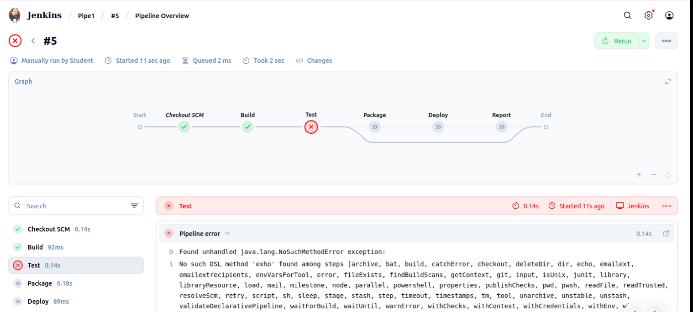
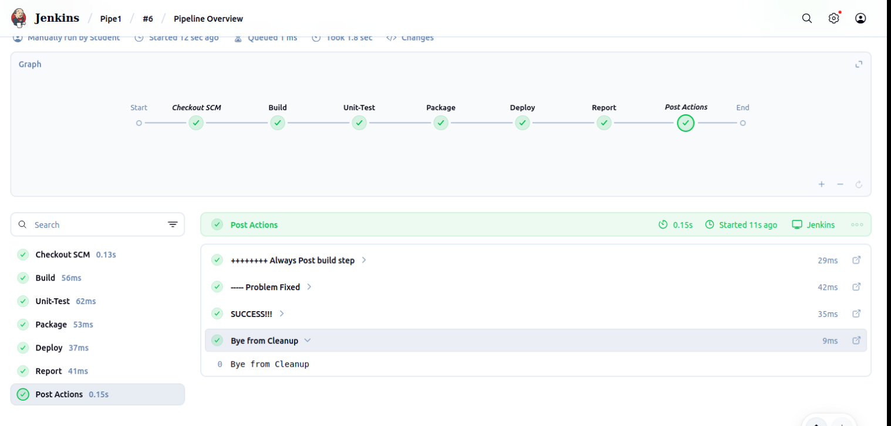

# Lab 4-2: Jenkins Pipleine

This lab walks you through the process of creating a simple Hello World pipeline

## Part 1: Re-Start Jenkins

- Since we will be using a local it repository, Jenkins will by default block access. 
- To allow local access
- Shut Jenkins down by going to the terminal you started it up in and entering control-C

- Restart Jenkins with command that will ensure we can use local git repositories

`java  -Dhudson.plugins.git.GitSCM.ALLOW_LOCAL_CHECKOUT=true -jar jenkins.war`

```bash
protech@studentvm:~/Jenkins$ java  -Dhudson.plugins.git.GitSCM.ALLOW_LOCAL_CHECKOUT=true -jar jenkins.war
Running from: /home/protech/Jenkins/jenkins.war
webroot: /home/protech/.jenkins/war
2025-10-18 21:38:57.897+0000 [id=1]	INFO	winstone.Logger#logInternal: Beginning extraction from war file
2025-10-18 21:38:58.020+0000 [id=1]	WARNING	o.e.j.ee9.nested.ContextHandler#setContextPath: Empty contextPath
2025-10-18 21:38:58.122+0000 [id=1]	INFO	org.eclipse.jetty.server.Server#doStart: jetty-12.0.22; built: 2025-06-02T15:25:31.946Z; git: 335c9ab44a5591f0ea941bf350e139b8c4f5537c; jvm 21.0.8+9-Ubuntu-0ubuntu122.04.1
2025-10-18 21:38:58.617+0000 [id=1]	INFO	o.e.j.e.w.StandardDescriptorProcessor#visitServlet: NO JSP Support for /, did not find org.eclipse.jetty.ee9.jsp.JettyJspServlet
2025-10-18 21:38:58.696+0000 [id=1]	INFO	o.e.j.s.DefaultSessionIdManager#doStart: Session workerName=node0
2025-10-18 21:38:59.207+0000 [id=1]	INFO	hudson.WebAppMain#contextInitialized: Jenkins home directory: /home/protech/.jenkins found at: $user.home/.jenkins
2025-10-18 21:38:59.338+0000 [id=1]	INFO	o.e.j.s.handler.ContextHandler#doStart: Started oeje9n.ContextHandler$CoreContextHandler@60afd40d{Jenkins v2.516.2,/,b=file:///home/protech/.jenkins/war/,a=AVAILABLE,h=oeje9n.ContextHandler$CoreContextHandler$CoreToNestedHandler@28a2a3e7{STARTED}}
2025-10-18 21:38:59.349+0000 [id=1]	INFO	o.e.j.server.AbstractConnector#doStart: Started ServerConnector@15deb1dc{HTTP/1.1, (http/1.1)}{0.0.0.0:8080}
2025-10-18 21:38:59.373+0000 [id=1]	INFO	org.eclipse.jetty.server.Server#doStart: Started oejs.Server@57c758ac{STARTING}[12.0.22,sto=0] @2077ms
2025-10-18 21:38:59.375+0000 [id=34]	INFO	winstone.Logger#logInternal: Winstone Servlet Engine running: controlPort=disabled
2025-10-18 21:38:59.546+0000 [id=33]	INFO	jenkins.model.Jenkins#<init>: Starting version 2.516.2
2025-10-18 21:38:59.667+0000 [id=40]	INFO	jenkins.InitReactorRunner$1#onAttained: Started initialization
2025-10-18 21:38:59.821+0000 [id=44]	INFO	jenkins.InitReactorRunner$1#onAttained: Listed all plugins
2025-10-18 21:39:03.161+0000 [id=41]	INFO	jenkins.InitReactorRunner$1#onAttained: Prepared all plugins
2025-10-18 21:39:03.185+0000 [id=39]	INFO	jenkins.InitReactorRunner$1#onAttained: Started all plugins
2025-10-18 21:39:03.194+0000 [id=43]	INFO	jenkins.InitReactorRunner$1#onAttained: Augmented all extensions
2025-10-18 21:39:03.628+0000 [id=39]	INFO	h.p.b.g.GlobalTimeOutConfiguration#load: global timeout not set
2025-10-18 21:39:04.500+0000 [id=44]	INFO	jenkins.InitReactorRunner$1#onAttained: System config loaded
2025-10-18 21:39:04.502+0000 [id=42]	INFO	jenkins.InitReactorRunner$1#onAttained: System config adapted
2025-10-18 21:39:04.758+0000 [id=43]	INFO	jenkins.InitReactorRunner$1#onAttained: Loaded all jobs
2025-10-18 21:39:04.765+0000 [id=39]	INFO	jenkins.InitReactorRunner$1#onAttained: Configuration for all jobs updated
2025-10-18 21:39:04.810+0000 [id=46]	INFO	jenkins.InitReactorRunner$1#onAttained: Completed initialization
2025-10-18 21:39:04.868+0000 [id=33]	INFO	hudson.lifecycle.Lifecycle#onReady: Jenkins is fully up and running

```

## Part 2: Create the project and run

- Create a new Pipeline project called `Pipe1`



- From the "Sample Pipelines", select "Hello World"



- You should see this. Click on save



- Run the project
- Explore the output of the build, note in particular that the console output shows the stages that executed, although there was only one in this project



## Part 3: Run from a repository

- Create a new git repository on the local machine.
- In these notes, the repo was created at `/home/protech/pipeline`
- Copy the Hello World pipeline code and save it into a text file named ``Jenkinsfile``

```bash
protech@studentvm:~$ mkdir pipeline
protech@studentvm:~$  cd pipeline
protech@studentvm:~/pipeline$ git init
Initialized empty Git repository in /home/protech/pipeline/.git/
protech@studentvm:~/pipeline$ git add Jenkinsfile
protech@studentvm:~/pipeline$ git commit -m "Initial init"
[main (root-commit) a259bca] Initial init
 1 file changed, 12 insertions(+)
 create mode 100644 Jenkinsfile

protech@studentvm:~/pipeline$ git log
commit a259bca4608b89c3086007502167d33089f16797 (HEAD -> main)
Author: Rocket Student <noone@nowhere.com>
Date:   Sat Oct 18 17:08:25 2025 -0400

    Initial init
```

- Open up the Pipe1 project in Jenkins
- Change the Pipeline from "Pipeline Script" to "Pipeline script from SCM"
- Use `git` as the SCM option
- Enter the location of the repository where you saved the `Jenkinsfile`




- Makes sure you specify the main branch and the name of the Jenkinsfile




- Save the configuration
- Run the file and it should execute exactly like before

## Part 4: Multistage Pipelines

- Now that the `Jenkinsfile` is under version control, we will just edit the file to modify the pipeline. 
- We won't be doing any more configuration in Jenkins, we will just use Jenkins to execute the pipeline

### Edit the Jenkinsfile

- Replace the contents of the Jenkinsfile with the code below and commit the changes

```bash
pipeline {
  agent any
  
  stages {
     stage('Build') {
       steps {
         echo 'Build'
        }
    }
    stage('Test') {
      steps {
        echo 'Test'
        }
    }
    stage('Package') {
      steps {
        echo 'Package'
        }
    }
    stage('Deploy') {
      steps {
        echo 'Deploy'
        }
    }
   stage('Report') {
     steps {
       echo 'Report'
        }
    }
}
}

```

- Go back to Jenkins and run the project
- When completed look at the Pipline Overview for the build



- Also check the console output to see the output for different stages

### Introduce an error

- Change the `Test` stage to this in the Jenkinsfile

```bash
  stage('Test') {
      steps {
        exho 'Test'
        }
    }
```

- Commit the changes and rerun the project
- Check the pipline overview and console output
- Note that the error aborts project and stages after the error are not run



## Part 5: Post Build Stages

- In this part of the lab, you will add and experiment with post build stages

- Replace your Jenkinsfile with this one

```bash
pipeline {
    agent any

    stages {
        stage('Build') {
            steps {
                echo 'Build'
            }
        }
    stage('Unit-Test') {
            steps {
                echo 'Unit Test'
             
                
            }
        }
    stage('Package') {
            steps {
                echo 'Package'
            }
        }
    stage('Deploy') {
            steps {
                echo 'Deploy'
            }
        }
    stage('Report') {
            steps {
                echo 'Report'
            }
        }
    }
    post {
        always {
            echo '++++++++ Always Post build step'
        }
        success {
            echo 'SUCCESS!!!'
        }
        failure {
            echo '***** Failure occurred'
        }
          fixed {
            echo '----- Problem Fixed'
        }
        cleanup {
            echo 'Bye from Cleanup'
        }
    }
    
}
```

- Commit the changes to the repository and run the project
- Check the pipeline overview 



- Notice that the `fixed` stage will run if your last run was a failer
- Run it a second time and see the difference

- Experiment wth introducing and error into one of the stages and see how the post build steps execute
- CCorrect the error and see how the behavior of the post build steps changes

### End


